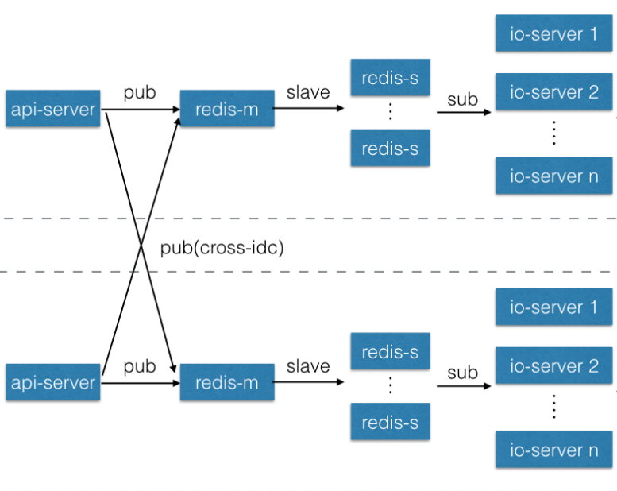

Push-Server
=======================
部署图(两机房部署)

测试服务器 http://spush.yy.com/

##install & run

* 安装nodejs环境

https://nodejs.org/en/download/package-manager/

* 安装/启动redis
```
redis-server &
```

* 安装/更新socket.io-push
```
sudo npm install -g socket.io-push
```

* 新建工作目录
```
mkdir push-server    
cd push-server
```

* 新建config.js

```
var config = {};

config.pingTimeout = 25000; //  心跳timeout
config.pingInterval = 25000; // 心跳间隔

config.tokenTTL = 1000 * 3600 * 24 * 30; // apn/xiaomi/huawei timeToLive

//apns推送配置,可选
config.apns = [
    {
        production: false,
        maxConnections: 100,
        bundleId: "com.xuduo.pushtest",
        cert: process.cwd() + "/cert/com.xuduo.pushtest/cert.pem",
        key: process.cwd() + "/cert/com.xuduo.pushtest/key.pem"
    },
    {
        production: false,
        maxConnections: 50,
        bundleId: "com.xuduo.pushtest2",
        cert: process.cwd() + "/cert/com.xuduo.pushtest2/cert.pem",
        key: process.cwd() + "/cert/com.xuduo.pushtest2/key.pem"
    }
];

//华为推送配置,可选, 由于华为不支持多包名,需要像apn一样配置一个数组
config.huawei = [{
    package_name: "com.yy.misaka.demo",
    client_id: 10513719,
    client_secret: "9l7fwfxt0m37qt61a1rh3w0lg9hjza1l"
}]

//小米推送配置,可选, 小米内建支持多包名, 一个配置就可以
config.xiaomi = {
    app_secret: "ynJJ6b+MkCLyw1cdrg/72w=="
}

//api调用鉴权,可选
config.apiAuth = function (path, req, logger) {
    var ip = req.headers['x-real-ip'] || req.connection.remoteAddress;
    logger.info("%s caller ip %s", path, ip);
    return true;
}

/**
 * 数组表示hash切片,可以配置多个redis实例,分担流量/cpu负载
 * pubs 广播pub redis,二维数组 第一级表示redis分组 第二季表示hash切片
 * sub 订阅接收 redis
 * write 数据存储主库
 * read 数据读从库
 * event 客户端断线,连接事件pub的redis.功能可能以后会改,不推荐使用
 */
config.redis = {
    pubs: [
        [
            {host: "127.0.0.1", port: 6379}
        ]
    ],
    sub: [
        {host: "127.0.0.1", port: 6379}
    ],
    write: [
        {host: "127.0.0.1", port: 6379}
    ],
    read: [
        {host: "127.0.0.1", port: 6379}
    ],
    event: [
        {
            host: "127.0.0.1",
            port: 6379
        }
    ]
};

config.io_port = 10001; //socket.io 长连接端口
config.api_port = 11001; //api端口, 可选. 不配置,不提供api接口

config.ttl_protocol_version = 2; //默认1, 推荐使用2,省流量

module.exports = config;

```

#运行
push-server -v -f
-f foreground
-d debug     
-c 起的进程数

#后台地址
http://yourip:10001/

#websocket地址
http://yourip:11001/

##Nginx reverse proxy

nginx.conf

```
upstream ws_backend {
    ip_hash;
    server 127.0.0.1:11001;
    server 127.0.0.1:11002;
    server 127.0.0.1:11003;
}

upstream ws_api {
    ip_hash;
    server 127.0.0.1:12001;
    server 127.0.0.1:12002;
    server 127.0.0.1:12003;
}

server
{
    listen 80;

    location / {
        proxy_pass http://ws_backend;
        proxy_http_version 1.1;
        proxy_set_header Upgrade $http_upgrade;
        proxy_set_header X-Forwarded-For $proxy_add_x_forwarded_for;
        proxy_set_header Host $host;
        proxy_set_header Connection "upgrade";
    }
    
    location /api {
        proxy_pass http://ws_api;
    }
}
```

##HTTP API

string[]类型,表示http协议中list类型参数，如 get?uid=123&uid=456 ,表示一个uid数组 ["123", "456"]. get?uid=123 表示单个uid数组 [123]

### /api/push 应用内透传

//推送给abc,def两个客户端.透传数据为字符串hello world (base64 aGVsbG8gd29ybGQ),到topic=/topic/test

http://yourip:11001/api/push?pushAll=true&data=aGVsbG8gd29ybGQ&topic=/topic/test

--- 以下参数3选一,指定推送对象

topic -> string, 客户端订阅的topic, (subscribeBroadcast的才能收到)

pushId -> string[], 如 ["abc","def"] 客户端生成的随机ID,单个或者数组

uid -> string[],如 ["123","456"] 通过addPushIdToUid接口绑定的uid

---

json ->  以下类型三选一,透传给客户端的数据,客户端会在onPush里接收到

         string "test string" (如要使用其他协议,如protobuf,可以使用base64 encoded string)

         json map  {"uri":1, content:"test string"}

         json array  [1, {"content":"test string"}] 
         
         一般业务建议使用json数组(省流量)
         
         第一个int或string来表示推送类型,第二个参数表示该类型的透传数据

---

timeToLive -> int, 毫秒, 表示当时用户不在线, 消息服务器保存多久

### /api/notification 状态栏通知api

http://yourip:11001/api/notification?pushId=true&notification=%7B%20%22android%22%3A%7B%22title%22%3A%22title%22%2C%22message%22%3A%22message%22%7D%2C%22apn%22%3A%7B%22alert%22%3A%22message%22%20%2C%20%22badge%22%3A5%2C%20%22sound%22%3A%22default%22%2C%20%22payload%22%3A1234%7D%7D

--- 以下参数4选一,指定推送对象

pushAll -> string, true表示推送全网,其它或者留空表示单个推送

pushId -> string[], 如 ["abc","def"] 客户端生成的随机ID,单个或者数组

uid -> string[],如 ["123","456"] 通过addPushIdToUid接口绑定的uid

tag -> string[] ,如 ["tag1","tag2"] 或 string, 如 "tag1", 通过客户端或者服务器接口设置的tag

---

timeToLive -> int, 毫秒, 表示当时用户不在线, 消息服务器保存多久 , 小米, 苹果, 华为, push-sever均支持

---

notification -> 通知消息内容 需要url encode

```
{
  "android" : {"title":"title","message":"message" },
  "apn":  {"alert":"message" , "badge":5, "sound":"default" },
  "payload": { "abc": 123}
}
```

notification是一个json map,内容说明如下

android - 推送给安卓手机的通知内容

apn - 通过apns推送给ios手机的通知内容

title & message - 安卓通知栏的消息标题和内容

alert(ios) - (apn对应的alert字段)消息内容

badge(ios) - (apn对应的badge字段) 可选

sound(ios) - (apn对应的sound字段) 可选

payload - 发送给应用非显示用的透传信息, 需要是一个json map


### /api/uid/bind 绑定UID和pushId

http://yourip:11001/api/uid/bind?pushId=abc&uid=123&platform=ios

pushId -> string(必选),客户端生成的随机ID

uid -> string(必选),服务器需要绑定的UID

timeToLive -> int毫秒(可选), 默认 = 0, 不过期. > 0 时,表示多久客户端没连接到push-sever后, 对应关系过期

platform -> string(可选), 默认 = "default", pushId所属平台

platformLimit -> int(可选), 默认 = 0, 表示不限制. 不为0时, 表示保留多少该平台的pushId绑定关系, 优先删除最旧的绑定关系

### /api/uid/remove 解除pushId的绑定

http://yourip:11001/api/uid/remove?pushId=abc

pushId -> string,客户端生成的随机ID
